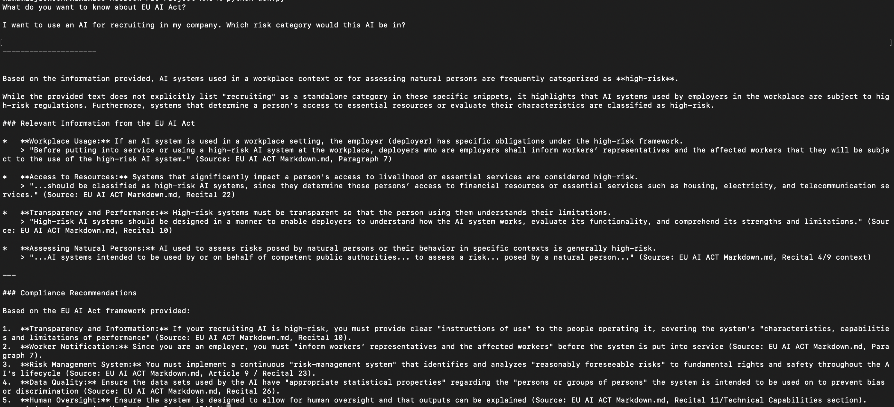

# EU AI Act RAG System

A Retrieval-Augmented Generation (RAG) system that answers questions about the EU AI Act using semantic search and Google's Gemini AI. Get accurate, compliance-focused guidance with citations directly from the regulatory text.

## 📸 Project Overview



*Example: The RAG system correctly identifies that AI used for recruiting would be classified as **high-risk** under the EU AI Act and provides relevant compliance recommendations.*

> **Note**: The `project_overview.png` file should be placed in the root directory of the project. This screenshot demonstrates the system in action, showing how it answers compliance questions with regulatory citations.

## 🎯 Features

- **Semantic Search**: Finds relevant EU AI Act sections using vector embeddings
- **Citation-Based Responses**: All answers include direct references to the regulation
- **Compliance Guidance**: Automatic compliance recommendations based on your questions
- **Hallucination Prevention**: System limited to provided documents only—no fabricated information
- **Easy Query Interface**: Simple terminal-based Q&A interaction

## 🛠️ Tech Stack

- **Vector Database**: ChromaDB (persistent vector storage)
- **LLM**: Google Gemini 3 Flash
- **Text Processing**: LangChain
- **Language**: Python 3.11+

## 📋 Prerequisites

- Python 3.11 or higher
- Google Generative AI API key (free at [Google AI Studio](https://aistudio.google.com/apikey))
- macOS, Linux, or Windows

## ⚙️ Installation

### 1. Clone the Repository
```bash
git clone https://github.com/nvmindmname-alt/RAG-system.git
cd RAG-system
```

### 2. Create Virtual Environment
```bash
python -m venv venv
source venv/bin/activate  # On Windows: venv\Scripts\activate
```

### 3. Install Dependencies
Choose one based on your needs:

**Option A: Minimal Installation (Recommended for most users)**
```bash
pip install -r requirements_minimal.txt
```

**Option B: Full Installation (Development & monitoring)**
```bash
pip install -r requirements.txt
```

### 4. Set Up API Credentials
```bash
# Copy the example environment file
cp .env.example .env

# Edit .env and add your Google API key
# GOOGLE_API_KEY=your_api_key_here
```

> Get your free API key from [Google AI Studio](https://aistudio.google.com/apikey)

## 🚀 Usage

### Step 1: Populate the Vector Database
Run this once to load and index the EU AI Act:
```bash
python fill_db.py
```
This will:
- Load the EU AI Act from `data/EU AI Act Markdown.md`
- Split it into semantic chunks (300 characters with 100-character overlap)
- Store embeddings in ChromaDB

### Step 2: Query the System
```bash
python ask.py
```

You'll be prompted:
```
What do you want to know about EU AI Act?
```

Example queries:
- "What are the requirements for high-risk AI systems?"
- "What transparency obligations apply?"
- "How do I ensure GDPR compliance with AI?"
- "What are the penalties for non-compliance?"

## 📁 Project Structure

```
.
├── ask.py                          # Query interface & response generation
├── fill_db.py                      # Database population & indexing
├── requirements.txt                # Python dependencies
├── .env.example                    # Environment variables template
├── data/
│   └── EU AI Act Markdown.md      # Source regulatory document
├── chroma_db/                      # Vector database (persistent storage)
├── PROJECT_REPORT.md               # Detailed project documentation
└── README.md                       # This file
```

## 🔧 How It Works

1. **Data Preparation** (`fill_db.py`):
   - Loads EU AI Act markdown
   - Splits into 300-character chunks with semantic overlap
   - Generates embeddings using ChromaDB's default embedder
   - Stores in persistent vector database

2. **Query Processing** (`ask.py`):
   - Accepts natural language question from user
   - Performs semantic search, retrieving top-30 relevant chunks
   - Constructs system prompt with regulatory context
   - Sends to Gemini AI with compliance-focused instructions

3. **Response Generation**:
   - LLM synthesizes answer from retrieved context
   - Enforces citations and compliance recommendations
   - Prevents hallucination through knowledge boundaries

## 📚 Documentation

- **[PROJECT_REPORT.md](PROJECT_REPORT.md)**: Comprehensive project analysis including:
  - Objectives and context
  - Methodology and technical approach
  - Challenges and limitations
  - Results and recommendations

## ⚠️ Important Notes

### Disclaimer
This tool provides informational assistance about the EU AI Act. It is **not** a substitute for professional legal counsel. Always:
- Verify information against official regulatory texts
- Consult legal experts for compliance decisions
- Review sector-specific guidance from regulatory bodies

### API Costs
- Google Generative AI includes a free tier (60 requests/minute)
- Production use may incur charges; see [Google AI pricing](https://ai.google.dev/pricing)

### Knowledge Cutoff
- System knowledge based on EU AI Act (Regulation EU 2024/1689)
- Regulatory updates require manual document refresh
- Recommend quarterly updates to maintain accuracy

## 🚀 Future Enhancements

- [ ] Multi-language support (EU official languages)
- [ ] Integration with additional EU regulations (GDPR, Digital Services Act)
- [ ] Web UI for broader accessibility
- [ ] Local LLM option for cost reduction
- [ ] Sector-specific compliance profiles
- [ ] Chat history and conversation context
- [ ] Document versioning and change tracking

## 🤝 Contributing

Contributions are welcome! Feel free to:
- Report bugs and issues
- Suggest improvements
- Add support for additional regulations
- Improve documentation

## 📄 License

This project is licensed under the MIT License - see LICENSE file for details.

## 📞 Support

For questions or issues:
1. Check [PROJECT_REPORT.md](PROJECT_REPORT.md) for technical details
2. Review existing issues in the repository
3. Create a new issue with detailed description

## 🔗 References

- [EU AI Act (Official Text)](https://eur-lex.europa.eu/eli/reg/2024/1689/oj)
- [ChromaDB Documentation](https://docs.trychroma.com/)
- [Google Generative AI](https://ai.google.dev/)
- [LangChain Documentation](https://python.langchain.com/)

---

**Created**: 2024 | **Last Updated**: May 2026
